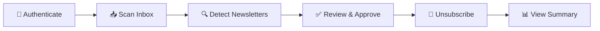

<div align="center">

# 📧 Gmail Newsletter Unsubscriber

### *"I hate unsubscribing from spam newsletters, so I built this."*

<p align="center">
  <strong>A beautiful, privacy-first automation tool that connects to your Gmail,<br/>detects newsletter spam, and helps you unsubscribe in bulk with one click.</strong>
</p>


---

## 🎥 Product Demo

**Watch the full demo video:**

[](https://drive.google.com/file/d/15Julk_RgMWgltsZZ5hu0JntGaklKPNNd/view?usp=sharing)

*See the app in action - from setup to unsubscribing in minutes!*

</div>

---

<div align="center">

## 🚀 Quick Start

</div>

```bash
./run.sh
```

**That's it!** The app opens at `http://localhost:8501` 🎉

---

## ✨ Features

<table>
<tr>
<td width="50%">

### 🎨 Beautiful Dark Mode UI
- ✨ One-click automation
- 📊 Real-time progress tracking
- 📈 Interactive charts with Plotly
- 📱 Responsive design

### 🤖 Smart Detection
- **Scoring Algorithm**: 5 signals combined
- **Confidence Threshold**: Adjustable sensitivity
- **Smart Grouping**: By sender, not individual emails
- **Multi-signal Analysis**: Headers, labels, keywords, patterns

</td>
<td width="50%">

### ⚙️ Customizable Settings
- 📅 **Days to scan**: 1-30 days (default: 7)
- 📬 **Max messages**: 100-2000 (default: 500)
- 🤖 **Auto-approve mode**: Skip manual review
- 🔄 **Skip unsubscribed**: Filter out history
- 🗑️ **Delete after unsub**: Move to trash

### 📊 Smart Features
- 📝 **History Tracking**: Never show the same sender twice
- 🔗 **Multiple Methods**: HTTP links, mailto, web forms
- 📄 **Beautiful Reports**: Markdown summaries with charts
- 🏷️ **Label Management**: Auto-label processed emails

</td>
</tr>
</table>

### 🔒 Privacy-First Design

> **Your data stays yours. Always.**

| ✅ What We Do | ❌ What We Don't Do |
|---------------|---------------------|
| Process everything locally | Store email content remotely |
| Keep OAuth tokens on your machine | Send data to external servers |
| Store only sender addresses | Access sensitive information |
| Open source - inspect every line | Hide our code or methods |

---

## 📱 The App

<details open>
<summary><h3>🏠 Home Page</h3></summary>

- ✅ Setup status check
- 🧭 Quick navigation
- 💡 Feature overview
- 📖 How it works

</details>

<details open>
<summary><h3>🔧 Setup Wizard (First Time Only)</h3></summary>

**Interactive 6-step guide** *(~4 minutes)*

```
1️⃣ Google Account     → Sign in
2️⃣ Create Project     → Auto-opens Cloud Console
3️⃣ Enable API         → One click
4️⃣ Get Credentials    → Download & upload
5️⃣ Add Test User      → Prevent OAuth errors
6️⃣ Complete           → Ready to go!
```

</details>

<details open>
<summary><h3>📧 Main App - Where the Magic Happens</h3></summary>



**The Complete Flow:**
1. **🔐 Authenticate** - Secure OAuth login
2. **📥 Scan** - Fetch recent emails
3. **🔍 Detect** - Identify newsletters with AI scoring
4. **✅ Review** - Approve senders (or auto-approve!)
5. **🚀 Unsubscribe** - Auto-execute unsubscribe requests
6. **📊 Summary** - Beautiful charts and reports

</details>

<details>
<summary><h3>📚 Documentation</h3></summary>

**In-app documentation with 7 comprehensive sections:**
- 🚀 Quick Start
- 🔧 Setup Guide
- 🎨 Streamlit UI
- 🔒 Privacy Policy
- ⚙️ How It Works
- 🤝 Contributing
- 🐛 Troubleshooting

</details>

---

## 🛠️ Setup

### 📋 Prerequisites

| Requirement | Version | Time Needed |
|-------------|---------|-------------|
| 🐍 Python | 3.7+ | - |
| 📧 Gmail Account | Any | - |
| ⏱️ Setup Time | - | ~5 minutes |

### 💻 Installation

<details open>
<summary><strong>Step 1: Clone the Repository</strong></summary>

```bash
git clone <your-repo-url>
cd gmail-newsletter-unsubscriber
```

</details>

<details open>
<summary><strong>Step 2: Run the App</strong></summary>

```bash
./run.sh
```

*The script automatically creates a virtual environment and installs dependencies!*

</details>

<details open>
<summary><strong>Step 3: Follow the Setup Wizard</strong></summary>

The app will guide you through:
- ✅ Google Cloud setup
- ✅ Auto-opens all necessary pages
- ✅ Upload credentials when prompted
- ✅ Add yourself as test user
- ✅ Done!

</details>

### ☁️ Google Cloud Setup (via Wizard)

> **Don't worry!** The Setup Wizard handles everything automatically.

**Behind the scenes:**

| Step | Action | Details |
|------|--------|---------|
| 1️⃣ | **Create Project** | Name it "Gmail Unsubscriber" |
| 2️⃣ | **Enable Gmail API** | One-click activation |
| 3️⃣ | **OAuth Consent Screen** | Choose "External", add app details |
| 4️⃣ | **Add Test User** | ⚠️ **Important!** Add your email |
| 5️⃣ | **Create Credentials** | Desktop app type |
| 6️⃣ | **Download & Upload** | Upload JSON to wizard |

---

## 🎯 How It Works

### 🧠 Detection Algorithm

**Multi-Signal Scoring System (0-100% confidence):**

<div align="center">

| 🎯 Signal | ⚖️ Weight | 📝 Example |
|-----------|-----------|------------|
| 📨 List-Unsubscribe header | **40%** | RFC 2369 standard |
| 🏷️ Gmail category labels | **20%** | CATEGORY_PROMOTIONS |
| 📄 Body keywords | **20%** | "unsubscribe", "opt out" |
| 📧 Subject keywords | **10%** | "newsletter", "digest" |
| 👤 Sender patterns | **10%** | "no-reply@", "marketing@" |

</div>

**Real Example:**

```diff
+ Email has List-Unsubscribe header:    +40%
+ Gmail labeled CATEGORY_PROMOTIONS:    +20%
+ Body contains "unsubscribe":          +20%
─────────────────────────────────────────────
= Total Confidence Score:                80%
✅ Classified as Newsletter!
```

### 🔗 Unsubscribe Methods

<table>
<tr>
<td width="33%" align="center">

**🔗 Simple Link**

*70% of cases*

HTTP GET/POST to unsubscribe URL

⚡ Instant execution

</td>
<td width="33%" align="center">

**📧 Mailto Link**

*20% of cases*

Sends unsubscribe email via Gmail API

🤖 Fully automated

</td>
<td width="33%" align="center">

**🌐 Web Form**

*10% of cases*

Requires login or complex form

⚠️ Flagged for manual review

</td>
</tr>
</table>

### 🔒 Privacy Guarantee

<table>
<tr>
<td width="33%">

**✅ What We Access**

- 📨 Email headers
  - From, Subject
  - List-Unsubscribe
- 📄 First 500 chars of body
  - For detection only
- 🏷️ Gmail labels

</td>
<td width="33%">

**💾 What We Store**

- 🔑 `credentials.json`
  - OAuth credentials (local)
- 🎫 `token.json`
  - OAuth token (local)
- 📝 `unsubscribed_history.txt`
  - Email addresses only
- 📊 `unsubscribe_summary.md`
  - Sender info only

</td>
<td width="33%">

**❌ What We DON'T Store**

- Full email content
- Email bodies
- Personal information
- Anything sensitive
- Remote data
- Third-party sharing

</td>
</tr>
</table>

---

## 📊 Usage

### 🎬 Basic Flow

```
1️⃣ Launch          →  ./run.sh
2️⃣ Click           →  "START CLEANING MY INBOX"
3️⃣ Review          →  Check detected newsletters
4️⃣ Approve         →  Select which to unsubscribe
5️⃣ Done!           →  View beautiful summary
```

### ⚙️ Settings (Sidebar)

| Setting | Description | Default |
|---------|-------------|---------|
| 🤖 **Auto-approve** | Skip manual review (lazy mode!) | OFF |
| 📅 **Days to scan** | How far back to look | 7 days |
| 📬 **Max messages** | Limit for large inboxes | 500 |
| 🎯 **Confidence threshold** | Detection sensitivity | 70% |
| 🔄 **Skip unsubscribed** | Filter out history | ON |
| 🗑️ **Delete after unsub** | Move to trash | OFF |

### 💡 Pro Tips

<table>
<tr>
<td width="33%">

**🛋️ Maximum Laziness**

1. ✅ Enable "Auto-approve"
2. 🖱️ Click "START CLEANING"
3. ☕ Get coffee
4. ✨ Return to clean inbox!

</td>
<td width="33%">

**🎮 Full Control**

1. ❌ Keep auto-approve OFF
2. 👀 Review each sender
3. ✅ Uncheck important ones
4. 🚀 Approve only spam

</td>
<td width="33%">

**🔄 Regular Maintenance**

- 📆 Run weekly/monthly
- 🚫 History prevents duplicates
- ✨ Perpetually clean inbox
- 🎯 Set it and forget it

</td>
</tr>
</table>

---

## 🔧 Configuration

Edit `src/config.py` to customize:

```python
# Scan settings
DAYS_TO_SCAN = 7
MAX_MESSAGES = 500
GMAIL_QUERY = "category:promotions OR category:updates"

# Detection
CONFIDENCE_THRESHOLD = 0.7
NEWSLETTER_KEYWORDS = ['unsubscribe', 'opt out', ...]

# Execution
AUTO_LABEL_PROCESSED = True
LABEL_NAME = "Unsubscribed"

# Whitelist
WHITELIST_DOMAINS = [
    # Add trusted domains here
]
```

---

## 🐛 Troubleshooting

<details>
<summary><h3>🚫 "Access blocked" OAuth Error</h3></summary>

**Problem:** App hasn't completed Google verification

**Solution:**
1. Go to [OAuth Consent Screen](https://console.cloud.google.com/apis/credentials/consent)
2. Scroll to "Test users"
3. Click "+ ADD USERS"
4. Add your Gmail address
5. Delete `token.json` and try again

</details>

<details>
<summary><h3>📄 "Missing credentials.json"</h3></summary>

**Solution:** Run the Setup Wizard in the app - it will guide you through downloading credentials from Google Cloud Console.

</details>

<details>
<summary><h3>🔍 No Newsletters Detected</h3></summary>

**Try these solutions:**
- 📅 Increase "Days to scan" (try 14 or 30 days)
- 🎯 Lower "Confidence threshold" (try 50-60%)
- 🔄 Disable "Skip already unsubscribed"
- 📧 Verify you have promotional emails in your inbox

</details>

<details>
<summary><h3>📝 History Not Working</h3></summary>

**Solutions:**
- ✅ Check "Skip already unsubscribed" is enabled
- 👀 View history in sidebar
- 🗑️ Clear history if needed
- 🔄 Restart app

</details>

---

## 📁 Project Structure

```
gmail-newsletter-unsubscriber/
├── Home.py                    # Landing page
├── run.sh                     # Launch script
├── requirements.txt           # Dependencies
│
├── pages/                     # Streamlit pages
│   ├── 0_🔧_Setup_Wizard.py
│   ├── 1_📧_Main_App.py
│   └── 2_📚_Documentation.py
│
├── src/                       # Core modules
│   ├── config.py
│   ├── gmail_auth.py
│   ├── gmail_client.py
│   ├── newsletter_detector.py
│   ├── unsubscribe_extractor.py
│   ├── unsubscribe_executor.py
│   ├── report_generator.py
│   └── main.py               # CLI version
│
├── output/                    # Generated files
│   ├── unsubscribe_summary.md
│   └── unsubscribed_history.txt
│
└── .streamlit/               # Theme config
    └── config.toml
```

---

## 🎨 Tech Stack

<div align="center">

| Layer | Technology | Purpose |
|-------|------------|---------|
| 🎨 **UI** | Streamlit | Beautiful dark mode interface |
| 📊 **Charts** | Plotly | Interactive visualizations |
| 📧 **API** | Google Gmail API | Email access & management |
| 🔐 **Auth** | OAuth 2.0 | Secure authentication |
| 🔍 **Parsing** | BeautifulSoup4 | HTML/Email parsing |
| 🌐 **HTTP** | Requests | Unsubscribe execution |
| 🐍 **Language** | Python 3.7+ | Core implementation |

</div>

---

## 🤖 Automation & Kiro Integration

### ✨ Smart Scheduling

The app includes **intelligent automation** that remembers your cleanup history and reminds you when it's time to run again!

**Features:**
- 📅 **Persistent State**: Tracks last run time across app restarts
- ⏰ **Smart Reminders**: Shows banner when cleanup is due
- 🔄 **Flexible Frequency**: Daily, Weekly, Bi-weekly, or Monthly
- 📊 **Statistics Dashboard**: View automation history and stats
- 🔗 **Kiro Integration**: Auto-syncs with Kiro hooks and workflows

### 🎯 How It Works

1. **First Run**: Complete your first cleanup manually
2. **Enable Automation**: Toggle "Enable Automatic Cleanup" in sidebar
3. **Set Frequency**: Choose how often to run (daily/weekly/monthly)
4. **Sit Back**: Get reminded when it's time, or let Kiro run it automatically!

### 🔧 Kiro Workflows & Hooks

**Included Workflows:**
- `scan_and_unsubscribe_gmail` - Full cleanup workflow
- `auto_cleanup` - Automated cleanup with state management

**Included Hooks:**
- `auto_newsletter_cleanup` - Scheduled cleanup trigger
- Automatically synced with your app settings!

**Manual Trigger:**
```bash
# Run via Kiro command palette
# Or trigger the workflow directly
```

**Automated Runs:**
- Enable in the Streamlit app settings
- Kiro hook file auto-updates with your preferences
- Runs on your chosen schedule (daily/weekly/monthly)

---

## 🚀 Future Enhancements

<table>
<tr>
<td width="33%">

### 🟢 Easy Wins

- [ ] More detection patterns
- [ ] Export/import whitelist
- [ ] Dry-run mode
- [ ] Email templates
- [ ] Custom themes
- [ ] Batch operations

</td>
<td width="33%">

### 🟡 Medium Effort

- [ ] LLM-based classification
- [ ] Browser automation
- [ ] Multi-account support
- [x] **Scheduled runs (Kiro hooks)** ✅
- [ ] Advanced filtering
- [ ] Email analytics

</td>
<td width="33%">

### 🔴 Advanced Features

- [ ] Outlook/Yahoo support
- [ ] REST API
- [ ] ML classification model
- [ ] Team collaboration
- [ ] Cloud deployment
- [ ] Mobile app

</td>
</tr>
</table>

---

## 🤝 Contributing

<div align="center">

**Contributions are welcome!** 🎉

</div>

### 📝 How to Contribute

```
1️⃣ Fork the repo
2️⃣ Create a feature branch
3️⃣ Make your changes
4️⃣ Add tests (if applicable)
5️⃣ Submit a pull request
```

### 💡 Contribution Ideas

| Category | Ideas |
|----------|-------|
| 🐛 **Bug Fixes** | Fix issues, improve stability |
| 💡 **Features** | New detection patterns, integrations |
| 📝 **Documentation** | Improve guides, add examples |
| 🎨 **UI/UX** | Design improvements, themes |
| 🧪 **Testing** | Increase test coverage |
| 🌍 **Localization** | Add language support |

---

## 📄 License

MIT License - See [LICENSE](LICENSE)

Feel free to use, modify, and distribute!

---

## 🎉 Built For

<div align="center">

### **Kiro Heroes Week 2 Challenge**

| 🏆 Challenge | 🎯 Theme | 💡 Focus | 🛠️ Tech Stack |
|--------------|----------|----------|---------------|
| Kiro Heroes Week 2 | Lazy Automation | Privacy-first, Real-world utility | Streamlit + Gmail API + Kiro |

</div>

---

## 🙏 Acknowledgments

<div align="center">

Built with ❤️ using amazing open-source tools

[](https://streamlit.io/)
[](https://developers.google.com/gmail/api)
[](https://python.org)

*Inspired by everyone who hates spam* 😤

</div>

---

## 📞 Support

<div align="center">

| 📖 Documentation | 🐛 Issues | 💬 Contact |
|------------------|-----------|------------|
| Check in-app docs | Open GitHub issue | Reach out to maintainers |

</div>

---

<div align="center">

## ⭐ Star This Repo!

**If this tool saved you time, give it a star!** ⭐

### Ready to clean your inbox?

```bash
./run.sh
```

### 🚀 Let's make email management less tedious!

---

<sub>Made with 💜 for developers who value their time and privacy</sub>

</div>
